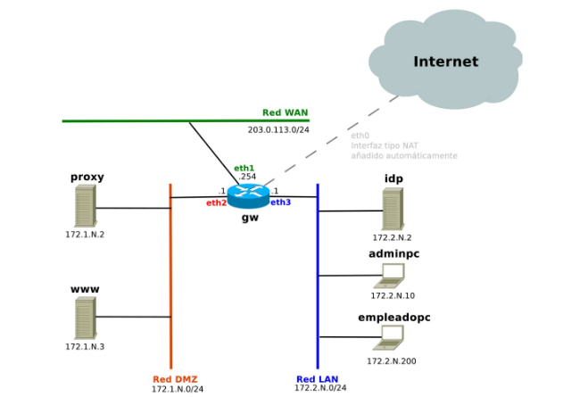
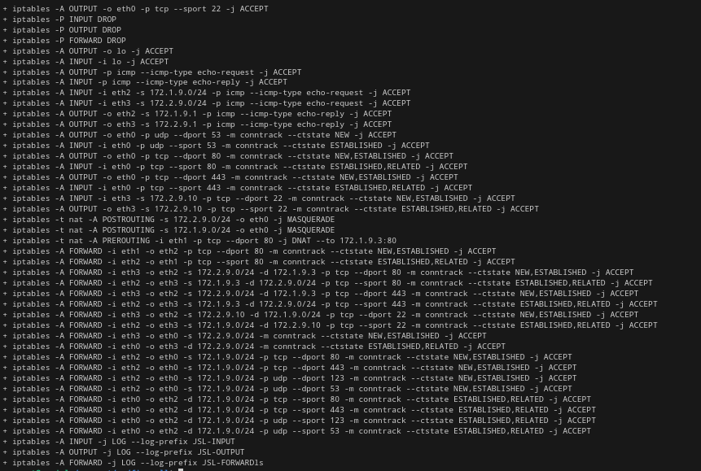
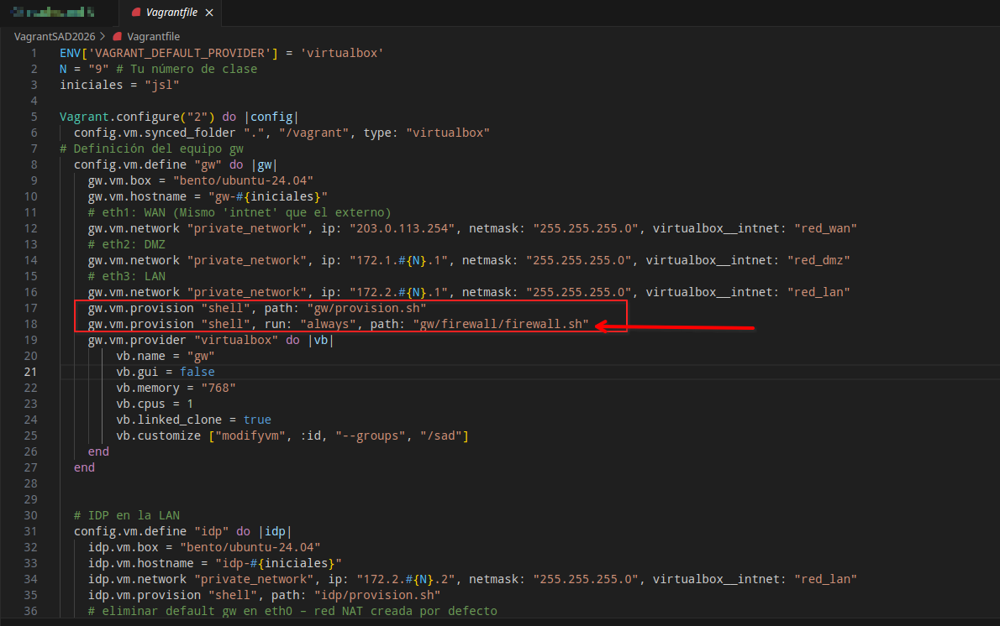
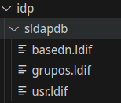
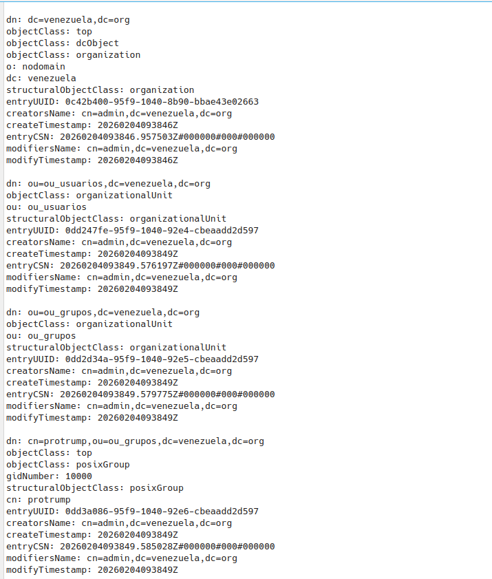
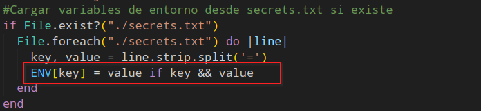
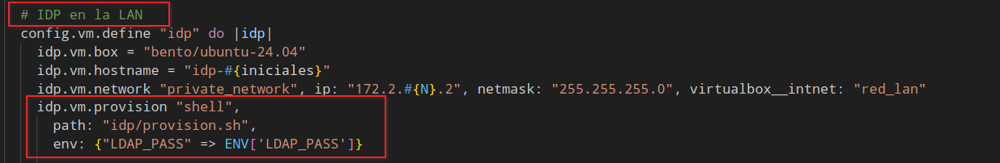

# Proyecto SAD Vagrant Firewall Cortafuegos de Gateway  rama UD5-fw
```
set -x
```
# Activar el IP forwarding
```
sysctl -w net.ipv4.ip_forward=1
```
# Limpiar reglas previas 
```
iptables -F
iptables -t nat -F
iptables -Z
```

# ANTI -LOCK RULES : Permitir ssh de la red de  eth0 para acceder a vagrant
```
iptables -A INPUT -i eth0 -p tcp --dport 22 -j ACCEPT
iptables -A OUTPUT -o eth0 -p tcp --sport 22 -j ACCEPT
```

# Política por defecto:
```
iptables -P INPUT DROP
iptables -P OUTPUT DROP
iptables -P FORWARD DROP
```
# ###############################
# Reglas de protección local
# ###############################


# L1. Permitir tráfico de loopback
```
iptables -A OUTPUT -o lo -j ACCEPT
iptables -A INPUT -i lo -j ACCEPT
```
# L2. Ping a cualquier host
```
iptables -A OUTPUT -p icmp --icmp-type echo-request -j ACCEPT
iptables -A INPUT -p icmp --icmp-type echo-reply -j ACCEPT
```
# L3. Permitir que me hagan ping desde la LAN Y DMZ
```
iptables -A INPUT -i eth2 -s 172.1.9.0/24 -p icmp --icmp-type echo-request -j ACCEPT
iptables -A INPUT -i eth3 -s 172.2.9.0/24 -p icmp --icmp-type echo-request -j ACCEPT
iptables -A OUTPUT -o eth2 -s 172.1.9.1 -p icmp --icmp-type echo-reply -j ACCEPT
iptables -A OUTPUT -o eth3 -s 172.2.9.1 -p icmp --icmp-type echo-reply -j ACCEPT
```
# L4. Permitir consultas DNS
```
iptables -A OUTPUT -o eth0 -p udp --dport 53 -m conntrack --ctstate NEW -j ACCEPT
iptables -A INPUT -i eth0 -p udp --sport 53 -m conntrack --ctstate ESTABLISHED -j ACCEPT
```
# L5. Permitir HTTP/HTTPS PARA actualizar y nevegar
```
iptables -A OUTPUT -o eth0 -p tcp --dport 80 -m conntrack --ctstate NEW,ESTABLISHED -j ACCEPT
iptables -A INPUT -i eth0 -p tcp --sport 80 -m conntrack --ctstate ESTABLISHED,RELATED -j ACCEPT
iptables -A OUTPUT -o eth0 -p tcp --dport 443 -m conntrack --ctstate NEW,ESTABLISHED -j ACCEPT
iptables -A INPUT -i eth0 -p tcp --sport 443 -m conntrack --ctstate ESTABLISHED,RELATED -j ACCEPT
```
# L.5 Permitir acceso ssh para admincpc
```
iptables -A INPUT -i eth3 -s 172.2.9.10 -p tcp --dport 22 -m conntrack --ctstate NEW,ESTABLISHED -j ACCEPT
iptables -A OUTPUT -o eth3 -s 172.2.9.10 -p tcp --sport 22 -m conntrack --ctstate ESTABLISHED,RELATED -j ACCEPT
```
# ###############################
# Reglas de protección de red
# ###############################


# R1. Se debe hacer NAT del trafico saliente
```
iptables -t nat -A POSTROUTING -s 172.2.9.0/24 -o eth0 -j MASQUERADE
iptables -t nat -A POSTROUTING -s 172.1.9.0/24 -o eth0 -j MASQUERADE
```
# R2Permitir acceso desde la WAN a WWW a traves del 80 haciendo part forwarding
```
iptables -t nat -A PREROUTING -i eth1 -p tcp --dport 80 -j DNAT --to 172.1.9.3:80
iptables -A FORWARD -i eth1 -o eth2 -p tcp --dport 80 -m conntrack --ctstate NEW,ESTABLISHED -j ACCEPT
iptables -A FORWARD -i eth2 -o eth1 -p tcp --sport 80 -m conntrack --ctstate ESTABLISHED,RELATED -j ACCEPT
```
# R3.a.Usuario de lña LAN pueden acceder a internet por 80 y 443
```
iptables -A FORWARD -i eth3 -o eth2 -s 172.2.9.0/24 -d 172.1.9.3 -p tcp --dport 80 -m conntrack --ctstate NEW,ESTABLISHED -j ACCEPT
iptables -A FORWARD -i eth2 -o eth3 -s 172.1.9.3 -d 172.2.9.0/24 -p tcp --sport 80 -m conntrack --ctstate ESTABLISHED,RELATED -j ACCEPT

iptables -A FORWARD -i eth3 -o eth2 -s 172.2.9.0/24 -d 172.1.9.3 -p tcp --dport 443 -m conntrack --ctstate NEW,ESTABLISHED -j ACCEPT
iptables -A FORWARD -i eth2 -o eth3 -s 172.1.9.3 -d 172.2.9.0/24 -p tcp --sport 443 -m conntrack --ctstate ESTABLISHED,RELATED -j ACCEPT
```
# R3.b. adminpc debe poder acceder por ssh a cualquier maquina de DMZ
```
iptables -A FORWARD -i eth3 -o eth2 -s 172.2.9.10 -d 172.1.9.0/24 -p tcp --dport 22 -m conntrack --ctstate NEW,ESTABLISHED -j ACCEPT
iptables -A FORWARD -i eth2 -o eth3 -s 172.1.9.0/24 -d 172.2.9.10 -p tcp --sport 22 -m conntrack --ctstate ESTABLISHED,RELATED -j ACCEPT
```

# R4. Permitir tráfico  desde la LAN
```
iptables -A FORWARD -i eth3 -o eth0 -s 172.2.9.0/24 -m conntrack --ctstate NEW,ESTABLISHED -j ACCEPT
iptables -A FORWARD -i eth0 -o eth3 -d 172.2.9.0/24 -m conntrack --ctstate ESTABLISHED,RELATED -j ACCEPT
```
# R5 PERMITIR SALIR TRAFICO DESDE LA DMZ (SOLO HTTTP/HTTPS/DNS/NTP)
```
iptables -A FORWARD -i eth2 -o eth0 -s 172.1.9.0/24 -p tcp --dport 80 -m conntrack --ctstate NEW,ESTABLISHED -j ACCEPT
iptables -A FORWARD -i eth2 -o eth0 -s 172.1.9.0/24 -p tcp --dport 443 -m conntrack --ctstate NEW,ESTABLISHED -j ACCEPT
iptables -A FORWARD -i eth2 -o eth0 -s 172.1.9.0/24 -p udp --dport 123 -m conntrack --ctstate NEW,ESTABLISHED -j ACCEPT
iptables -A FORWARD -i eth2 -o eth0 -s 172.1.9.0/24 -p udp --dport 53 -m conntrack --ctstate NEW,ESTABLISHED -j ACCEPT

iptables -A FORWARD -i eth0 -o eth2 -d 172.1.9.0/24 -p tcp --sport 80 -m conntrack --ctstate ESTABLISHED,RELATED -j ACCEPT
iptables -A FORWARD -i eth0 -o eth2 -d 172.1.9.0/24 -p tcp --sport 443 -m conntrack --ctstate ESTABLISHED,RELATED -j ACCEPT
iptables -A FORWARD -i eth0 -o eth2 -d 172.1.9.0/24 -p udp --sport 123 -m conntrack --ctstate ESTABLISHED,RELATED -j ACCEPT
iptables -A FORWARD -i eth0 -o eth2 -d 172.1.9.0/24 -p udp --sport 53 -m conntrack --ctstate ESTABLISHED,RELATED -j ACCEPT


```
#### Logs para depurar ####
```
iptables -A INPUT -j LOG --log-prefix "JSL-INPUT" 
```
```
iptables -A OUTPUT -j LOG --log-prefix "JSL-OUTPUT"
```
```
iptables -A FORWARD -j LOG --log-prefix "JSL-FORWARD"ls
```




# Importante en el Archivo Vagrantfile se debe cambiar o añadir una ruta o/y Comando paraque cada vez que se haga Vagrant up se ejecute el firewall.sh y se ejecuten los comandos de Iptables para el FIrewall de el Gatewa



# Proyecto SAD Vagrant FAutenticación centralizada con OpenLDAP  rama UD4-ldap

# Necesitaremso para nuestra Organizacion estos scripts para Ldap
# Este es el script de basedn
```
dn: ou=ou_usuarios,dc=venezuela,dc=org
objectClass: organizationalUnit
ou: ou_usuarios

dn: ou=ou_grupos,dc=venezuela,dc=org
objectClass: organizationalUnit
ou: ou_grupos
```
# Este es el script de grupos
```
dn: cn=protrump,ou=ou_grupos,dc=venezuela,dc=org
objectClass: top
objectClass: posixGroup
gidNumber: 10000

dn: cn=promaduro,ou=ou_grupos,dc=venezuela,dc=org
objectClass: top
objectClass: posixGroup
gidNumber: 10001
```
# Este es el script de usuarios
```
dn: uid=javier,ou=ou_usuarios,dc=venezuela,dc=org
objectClass: top
objectClass: posixAccount
objectClass: inetOrgPerson
objectClass: person
cn: javier sanchez
givenName: Javier
sn: sanchez
uid: javier
uidNumber: 2000
gidNumber: 10001
homeDirectory: /home/javier
loginShell: /bin/bash
userPassword: {SSHA}P1/7O++4GyQT8QRBGhZ1VmRLUncJSS3P
mail: javier@venezuela.org

dn: uid=fran,ou=ou_usuarios,dc=venezuela,dc=org
objectClass: top
objectClass: posixAccount
objectClass: inetOrgPerson
objectClass: person
cn: fran ragusa
givenName: fran
sn: ragusa
uid: fran
uidNumber: 2001
gidNumber: 10000
homeDirectory: /home/fran
loginShell: /bin/bash
userPassword: {SSHA}P1/7O++4GyQT8QRBGhZ1VmRLUncJSS3P
mail: fran@venezuela.org

dn: uid=pablo,ou=ou_usuarios,dc=venezuela,dc=org
objectClass: top
objectClass: posixAccount
objectClass: inetOrgPerson
objectClass: person
cn: pablo sanchez
givenName: fran
sn: pablo
uid: sanchez
uidNumber: 2001
gidNumber: 10001
homeDirectory: /home/pablo
loginShell: /bin/bash
userPassword: {SSHA}P1/7O++4GyQT8QRBGhZ1VmRLUncJSS3P
mail: pabloesteban@venezuela.org
```

# Usaremos un script que se llama provision.sh
```
#!/usr/bin/env bash

# El script se detiene si hay errores
set -e
export DEBIAN_FRONTEND=noninteractive
echo "########################################"
echo " Aprovisionando idp "
echo "########################################"
echo "Actualizando repositorios"
apt-get update -y 
apt-get install -y net-tools iputils-ping curl tcpdump nmap

echo "--------------------------------- $LDAP_PASS -------------------------------"

# --- PARTE 1: Nuestros datos – sustituye con tus datos
DOMAIN="venezuela.org"
ORGANIZACION="Venezuela"
DB_DIR="/vagrant/idp/sldapdb"

# Cargamos datos en debconf para que no se nos pidan durante la configuración
sudo debconf-set-selections <<EOF
slapd slapd/no_configuration boolean false
slapd slapd/domain string ${DOMAIN}
slapd slapd/organization string ${ORGANIZACION}
slapd slapd/purge_database boolean true
EOF
# Instalamos paquetes necesarios para openldap
apt-get install -y slapd ldap-utils
apt-get autoremove -y
# Esto ignora cualquier fallo de debconf y pone la clave que viene de Vagrant
echo "[*] Forzando contraseña de administrador..."
# Generamos el hash porque openldap está dando mucha lata al cogerla directamente del entorno
SECURE_HASH=$(slappasswd -s "$LDAP_PASS")
cat <<EOF > /tmp/set_pass.ldif
dn: olcDatabase={1}mdb,cn=config
changetype: modify
replace: olcRootPW
olcRootPW: $SECURE_HASH
EOF
# Usamos -Y EXTERNAL para entrar como root del sistema, sin contraseña
ldapmodify -Y EXTERNAL -H ldapi:/// -f /tmp/set_pass.ldif
# Cargamos datos
echo "[*] Cargando base..."
ldapadd -x -D "cn=admin,dc=venezuela,dc=org" -w $LDAP_PASS -f "$DB_DIR/basedn.ldif" -c
echo "[*] Cargando grupos..."
ldapadd -x -D "cn=admin,dc=venezuela,dc=org" -w $LDAP_PASS -f "$DB_DIR/grupos.ldif" -c
echo "[*] Cargando usuarios..."
ldapadd -x -D "cn=admin,dc=venezuela,dc=org" -w $LDAP_PASS -f "$DB_DIR/usr.ldif" -c
echo "------ FIN ------"

```


# En el Vagrantfile debemos cambiar ciertas lineas.



# Debemos tener un archivo .env que se llamara secrets.txt
 
# y con este archivo y la variable para la contraseña junto a lo anterior de el vagrantfile